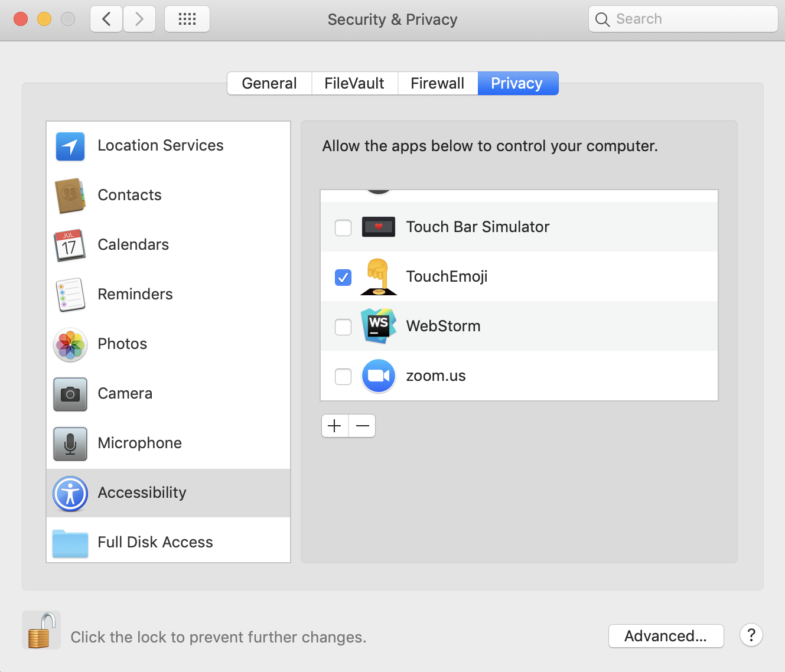

# Touch Emoji

> Emoji picker for MacBook Pro Touch Bar.

Launch an application adds 😀 icon to Control Strip:

Click to 😀 icon will open scrubber (swipeable panel) with emojis:

Touching a particular emoji inserts it into the current open window.

## Installation
* Download [lastest release](https://github.com/lm-a/touch-emoji/releases/download/v0.2.1/Touch-Emoji-v0.2.1.zip) from github
* Unpack arhive
* Move `Touch Emoji` to *Applications* folder

## Troubleshooting
#### Emoji touch doesn't work:

Re-tick or check a tick for access  → System Preferences → Security and Privacy → tab Privacy → Accessibility → TouchEmoji

## Author
Ilya Lesik (https://github.com/ilyalesik)

This app is based on [touch-bar-emojis](https://github.com/gabriellorin/touch-bar-emojis) by Gabriel Lorin (https://github.com/gabriellorin).
